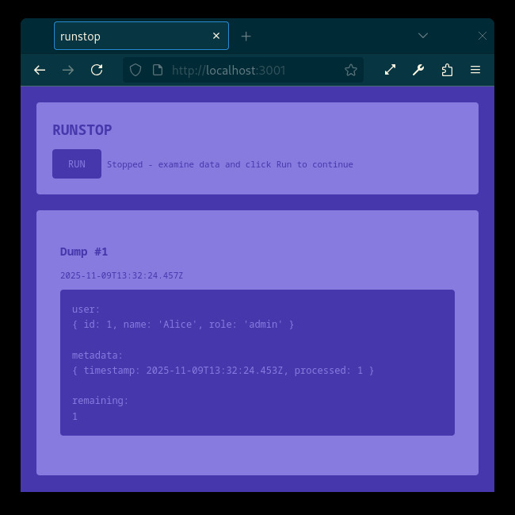
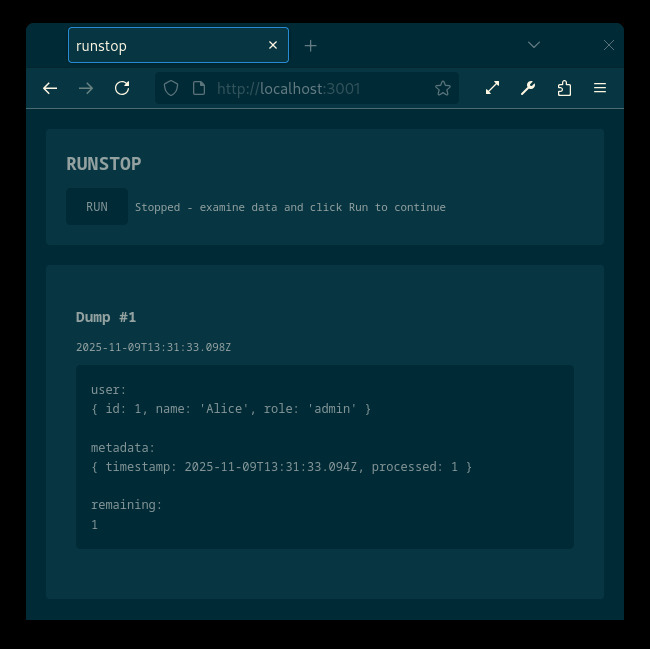

# RUNSTOP

**A precious little debugging tool that frees you from terminal constraints.**

Inspired by the Commodore 64's iconic RUN/STOP button, this ultra-lightweight async code inspection tool brings the joy of creative programming back to modern development.

---



---



---

## The Problem

You're building something amazing. Your code is processing data, iterating through collections, transforming objects. You want to see what's happening at a specific moment, but:

- The terminal is an awful place to examine complex objects
- `console.log()` of large datasets creates 41,944 lines of scrolling chaos
- Traditional debuggers break your flow and hide the data
- You just want to **STOP**, **LOOK**, and **RUN** again

## The Solution

```javascript
import runstop from 'runstop';

for await (const post of await page.posts()) {
  blogPage.addPost({
    title: post.title,
    date: 'Nov 8, 2025',
    datetime: '2025-11-08',
    content: '<p>Hello, world!</p>',
  });

  await runstop({
    blogPage,
    service,
    website,
    book,
    page,
    post,
  });
}
```

That's it. Your program **STOPS**. A browser opens showing your data beautifully formatted. You examine everything at your leisure. When ready, click **RUN** to continue until the next stop.

## How It Works

1. **First `await runstop()`** - HTTP server starts on an available port
2. **Terminal prints URL** - `→ runstop: http://localhost:3000`
3. **Program STOPS** - Execution pauses, waiting for you
4. **Browser shows data** - All your objects inspected and formatted
5. **You examine** - Scroll, read, understand at your own pace
6. **Click RUN** - Program continues until the next `await runstop()`
7. **Repeat** - As many stops as you need

When you're done debugging, click **STOP** to terminate the server and let your program run freely to completion.

## Installation

```bash
npm install runstop
```

**Zero dependencies.** Just pure Node.js native modules. Because npm is no longer a secure environment, this tool uses only what Node.js provides: `http` and `util`.

## Features

### For Humans

- **Beautiful** - C64-inspired theme in light mode, Solarized in dark mode
- **Simple** - No configuration, no setup, just import and use
- **Intuitive** - Open page, see data, click run, repeat
- **Peaceful** - Examine 50,000 lines of output in comfort

### For Programmers

- **Netcat-style lightweight** - ~200 lines of code
- **No external dependencies** - Only Node.js native modules
- **Server-Sent Events** - Lightweight real-time updates
- **Persistent server** - Stays alive across multiple stops
- **Semantic HTML** - Clean structure with `<pre><code>` ready for syntax highlighting
- **Auto port-finding** - Starts on first available port from 3000

## Why This Matters

### Creative Programming Unleashed

Programming is a creative act. We're not just writing code; we're solving puzzles, building systems, crafting solutions. But traditional tools often constrain us:

- Debuggers force us into their paradigm
- Terminals limit how we see data
- Logging frameworks add complexity
- IDE features hide as much as they reveal

**Novel solutions like runstop break these constraints.** By thinking differently about debugging, we create something that:

- Works with your flow, not against it
- Shows data the way humans want to see it
- Requires zero configuration or learning curve
- Solves a real problem elegantly

### The Terminal Is Not Enough

When `console.log()` dumps 41,944 lines of JSON, you're not debugging anymore—you're drowning. The terminal wasn't designed for this. But your browser was. It scrolls smoothly, renders clearly, handles massive documents effortlessly.

**Why force inspection into the wrong medium?**

### Honoring History

The Commodore 64's **RUN/STOP** button was brilliant in its simplicity. One button. Two states. Complete control. This tool honors that elegance:

- **RUN** - Continue execution
- **STOP** - Terminate debugging, run freely

No complicated menus. No configuration files. No learning curve. Just the power to control execution with a single action.

## Examples

### Basic Usage

```javascript
import runstop from 'runstop';

const data = { users: [...], settings: {...}, status: 'processing' };
await runstop(data);
```

### In Async Loops

```javascript
import runstop from 'runstop';

for await (const item of collection) {
  const processed = await transform(item);
  const result = await validate(processed);

  await runstop({
    item,
    processed,
    result,
    metadata: { timestamp: new Date(), iteration: i }
  });
}
```

### Complex Object Inspection

```javascript
import runstop from 'runstop';

const complexState = {
  database: dbConnection,
  cache: cacheLayer,
  queue: messageQueue,
  stats: performanceMetrics,
  errors: errorLog
};

await runstop(complexState);
```

The browser shows everything with `util.inspect` formatting—nested objects, arrays, functions, all clearly visible.

## API

### `runstop(objects)`

Pauses execution and displays objects in browser.

**Parameters:**
- `objects` - Object containing values to inspect (default: `{}`)

**Returns:**
- Promise that resolves when RUN button is clicked

**Example:**
```javascript
await runstop({
  user,
  session,
  timestamp: Date.now()
});
```

### Control Flow

- **First call** - Starts HTTP server, prints URL
- **Subsequent calls** - Reuses server, adds new dumps
- **RUN button** - Resumes execution to next stop
- **STOP button** - Terminates server, execution continues without further stops

## Advanced Usage

### Conditional Stops

```javascript
for (const item of items) {
  if (item.requiresInspection) {
    await runstop({ item, context });
  }
}
```

### Named Dumps

```javascript
await runstop({
  'User Data': userData,
  'Session Info': session,
  'Request Context': context
});
```

### Multiple Object Sets

```javascript
await runstop({ before: originalData });
const processed = transform(originalData);
await runstop({ after: processed, delta: getDelta() });
```

## Philosophy

### Keep It Simple

No frameworks. No build steps. No configuration. Import it, use it, done.

### Respect the Medium

Terminals are for commands. Browsers are for documents. Use each for what they do best.

### Honor History

The best ideas are often the simplest. RUN/STOP was perfect then. It's perfect now.

### Free the Programmer

Tools should serve creativity, not constrain it. Break assumptions. Try new approaches. Make debugging delightful.

## The Beauty of Constraints

This tool was built under a specific constraint: **no npm dependencies**. Not as a limitation, but as liberation. When you can't reach for a package, you think differently. You use what's there. You find elegant solutions.

Node's `http` module is powerful. `util.inspect` is beautiful. Server-Sent Events are simple. Together, they create something useful without adding complexity.

**Constraints breed creativity.**

## Contributing

This is a tiny tool with a clear purpose. Contributions welcome if they:

- Maintain zero dependencies
- Keep the code simple and readable
- Enhance the core functionality
- Respect the minimalist philosophy

## License

MIT

## Acknowledgments

Inspired by:
- The Commodore 64's RUN/STOP button
- The frustration of debugging in terminals
- The beauty of simple solutions
- The joy of creative programming

## A Note on Creative Programming

Programming is not just engineering—it's creativity constrained by logic. The best programs emerge when we question assumptions:

- "Why must debugging happen in a terminal?"
- "Why can't inspection be visual and comfortable?"
- "Why add complexity when simplicity works?"

**This tool exists because someone asked those questions.**

Your programming environment should work for you. When it doesn't, build something better. When you hit constraints, find creative solutions. When tools fail you, make new ones.

That's not just debugging. That's creative programming.

---

**Stop when you need to. Run when you're ready.**
